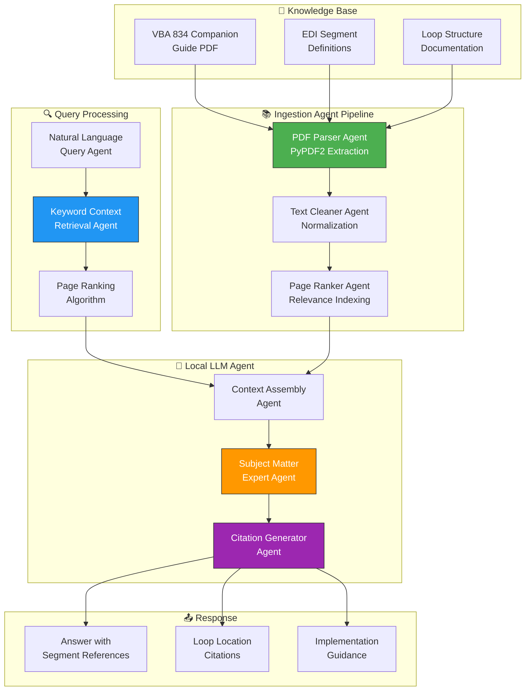
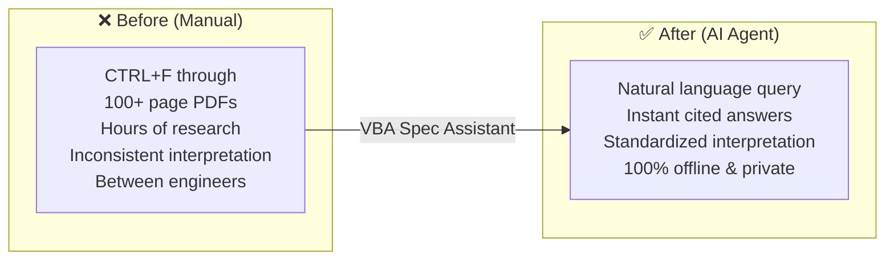

# 📋 VBA Spec Assistant — AI-Powered EDI 834 Documentation Agent

> **An intelligent RAG (Retrieval-Augmented Generation) agent that interprets complex healthcare EDI specifications**  
> Ask natural language questions about VBA 834 Companion Guide — get instant, citation-backed answers.

---

## 🧠 AI Agent Architecture



## 🤖 What the AI Agents Do

| Agent | Function |
|-------|----------|
| **PDF Ingestion Agent** | Parses 100+ page VBA 834 Companion PDF, extracts and normalizes text, indexes pages by segment/loop |
| **Context Retrieval Agent** | Instead of sending the entire document (which exceeds context windows), dynamically ranks pages based on relevance to your query using a keyword-driven algorithm |
| **Subject Matter Expert Agent** | Local LLM (via LM Studio) acts as an EDI specialist — System Prompt engineered for precision over creativity |
| **Citation Agent** | Every answer includes exact segment/loop references — "Loop 2300, Segment REF, Element REF02" |

## 🔄 Before vs After



## 🛠 Tech Stack

| Component | Technology | Agent Role |
|-----------|-----------|------------|
| **PDF Processing** | PyPDF2 | Document ingestion agent |
| **AI Engine** | OpenAI SDK (Local Endpoint) | LLM inference agent |
| **Retrieval** | Custom keyword ranking | Context retrieval agent |
| **Privacy** | 100% offline (LM Studio) | Security isolation agent |
| **Language** | Python 3.10+ | Agent framework |

## ⚡ Quick Start

```bash
# Ask a question about EDI 834 specs
python assistant.py "What is the REF segment in Loop 2300?"
# Output: Answer with citations to specific pages/segments
```

## 💡 Why This Matters

Healthcare interoperability projects often fail due to misinterpretation of EDI specs. This AI agent:
1. **Reduces Research Time:** No more CTRL+F through 100+ page PDFs
2. **Standardizes Interpretation:** Every engineer gets the same answer from the official guide
3. **Privacy-First:** Runs 100% offline using local inference — no proprietary docs leave your environment

---

Built by **[Shazaly Musa](https://github.com/SparkSpheartech)** — Founder, SparkSphear Tech  
*AI Agents for Healthcare EDI & Compliance*