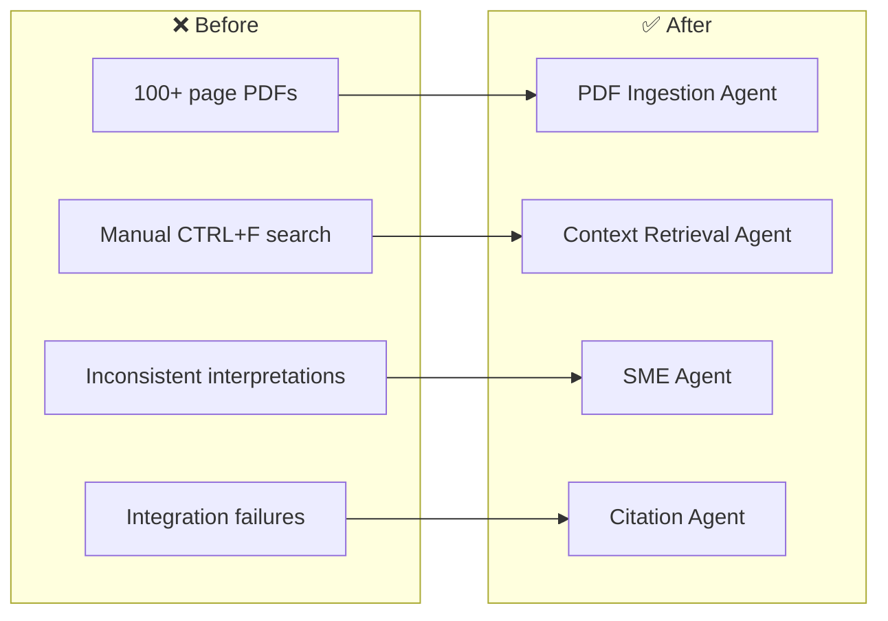
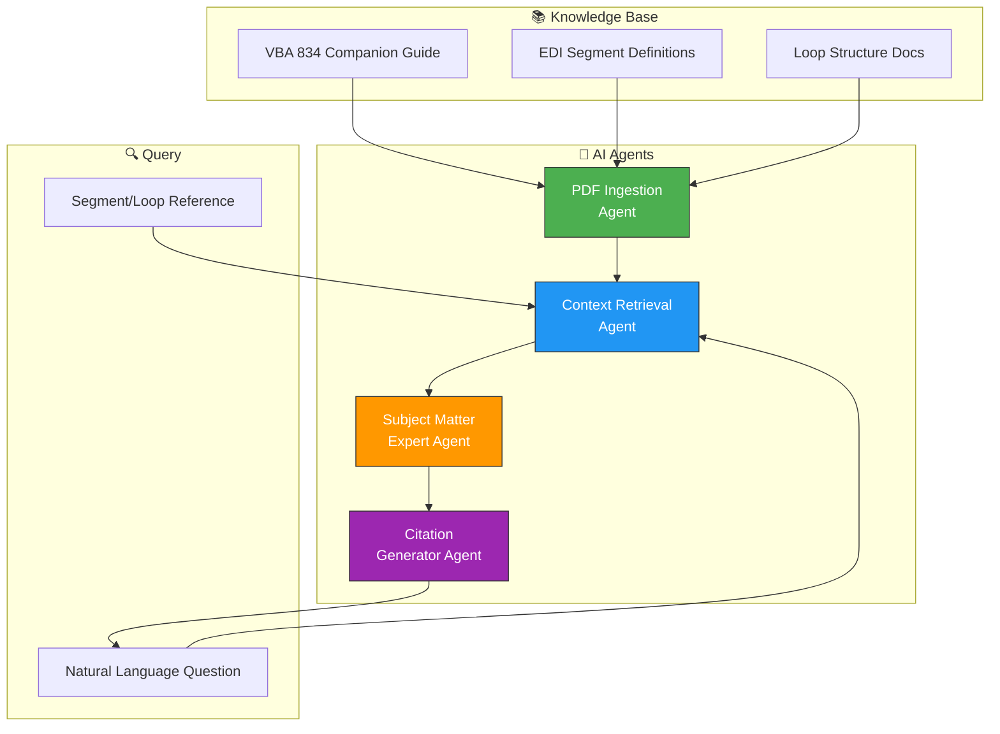

# 📋 Healthcare EDI Compliance — AI Agents for Spec Research

> SPARKSPHEAR builds AI agents for healthcare EDI compliance workflows across EDI engineers, healthcare IT teams, benefits administrators, and compliance officers.

**Start With the Workflow. Scale What Works.**

We audit the system, connect the tools that fit, and automate the work that does not require constant manual attention.

---

## ❌ The Problem

Healthcare interoperability projects fail due to misinterpretation of EDI specs. Engineers spend hours searching through 100+ page PDFs to find segment definitions. Each engineer interprets the spec differently — leading to integration failures. The compliance team does everything — and the review plateaus.

**Before:** Hours of manual PDF searching, inconsistent engineer interpretations, integration failures, compliance risks, knowledge trapped in static documents.

**After (AI Agent Fleet):** Natural language queries with instant citation-backed answers. Standardized interpretations across the entire engineering team. 100% offline and private.

---

## 🤖 AI Agent Fleet

Four AI agents that turn 100+ page EDI specs into instant, citation-backed answers.

### Architecture

### Answer and route
The agent handles approved EDI specification questions by retrieving relevant segments, loops, and code values from the companion guide. It captures the query, finds the exact segment definition with page reference, and returns citation-backed guidance.

### Bring clients back
Use documentation-specific return windows (quarterly guide updates, new carrier onboarding, integration testing cycles) to flag knowledge gaps and prepare compliance-approved guidance updates.

### Keep control
Implementation decisions, compliance interpretations, and engineering approvals stay behind permissions, escalation rules, and human review. The agent assists; you remain responsible.

---

## 🚀 Start With One Workflow

We do not start by selling the biggest package. We start by auditing the workflow and identifying the smallest useful agent.

**Workflow Audit — Starting at $297 one-time**
- Current workflow map
- Bottleneck analysis
- Existing-tool review
- Data and access requirements
- Agent suitability assessment
- Three prioritized automation opportunities
- Recommended first agent
- Implementation scope
- Measurement and acceptance plan

**Implementation — One-time build fee**
- Agent development and testing
- Approved integration setup
- Escalation rule configuration
- Acceptance criteria verification

**Monthly Agent Operation — Recurring package fee**

| Package | Price | Best For |
|---------|-------|----------|
| **SIGNAL START** | $297/mo | One narrow workflow, one primary channel, one or two approved integrations |
| **FLOW CONTROL** | $697/mo | Several related workflows with routing, follow-up, and exception handling |
| **SYSTEM LIFT** | $1,497/mo | Multiple workflows, channels, custom rules, and meaningful reporting |
| **SCALE CONTROL** | from $2,997/mo | Multi-location, operations-heavy, custom APIs and dashboards |

This maps to **SIGNAL START** — one narrow workflow (EDI specification research) with a single primary channel (text query) and one approved integration (local LLM).

---

Built by **[Shazaly Musa](https://github.com/SparkSpheartech)** — Founder, SparkSphear Tech  
*Start With the Workflow. Scale What Works.*  
*AI Agents for Healthcare EDI Compliance*